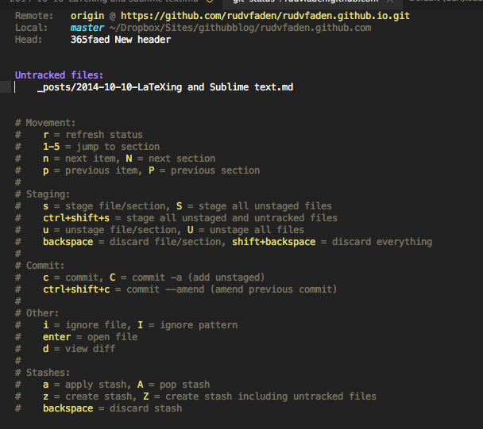

<section id="table-of-contents" class="toc">
  <header>
    <h3>Overview</h3>
  </header>

*  Auto generated table of contents
{:toc}

</section><!-- /#table-of-contents -->
[Sublime Text](http://www.sublimetext.com/) is an awesome text editor. Unlike editors like Vim and Emacs, which are very powerful, but also very difficult to learn (If you don't believe me, please read this [post](http://dorinlazar.ro/selling-vim-emacs-kids/) by Dorin Lazăr). Sublime Text has a very low entry barrier. Just fire it up and you are pretty much ready to go. But don't be fooled. Sublime Text is very advanced. I would argue that for most users, Sublime Text has all the features you need. The downside is that Sublime Text is not free like Vim and Emacs. In fact, at $70, the price is rather steep. But when you first figured out some of the more advanced features of Sublime Text, it's hard to go back to other text editors. Some of the features of Sublime Text are 

- Goto Anything
- Multiple Selections and columns selection
- Instant Project Switch
- Customization via packages

I use Sublime mostly for LaTeX and programming in Stata, R, Matlab etc. In this post I will show how to setup sublime to work with LaTeX. 

## Package control

The first thing you wanna do after installing Sublime Text 3, is to install Package control. Package control allows you to easily install, remove and update packages. To install open the Sublime Text console `View -> Show Console`. Then paste the following command and press `Enter`


import urllib.request,os,hashlib; h = '7183a2d3e96f11eeadd761d777e62404' + 'e330c659d4bb41d3bdf022e94cab3cd0'; pf = 'Package Control.sublime-package'; ipp = sublime.installed_packages_path(); urllib.request.install_opener( urllib.request.build_opener( urllib.request.ProxyHandler()) ); by = urllib.request.urlopen( 'http://sublime.wbond.net/' + pf.replace(' ', '%20')).read(); dh = hashlib.sha256(by).hexdigest(); print('Error validating download (got %s instead of %s), please try manual install' % (dh, h)) if dh != h else open(os.path.join( ipp, pf), 'wb' ).write(by)


## Setting up LaTeX in Sublime Text.

Generally there are two ways to go if you want to work with LaTeX in Sublime Text. [LaTeXing](http://www.latexing.com/) and [LaTeXTools](https://github.com/SublimeText/LaTeXTools).

LaTeXTools is free an open source. It has a lot of features and works very well, but it misses some features like code completion and project management. LaTeXing cost $15 + vat, but it is more advanced than LaTeXTools. It has code completion, import references from online services, like Mendeley or Zotero, automatic fill of cross references and packages, easy look up packages and a lot more. The install process is very similar for both. So if you wanna use LaTeXTools, just replace LaTeXing with LaTeXTool below.  

### Installing LaTeXing

The following assumes that you have a working latex installation like TeXlive, MikTeX or MacTeX. If not install them before continuing.

- First press `C+shift+p` to launch the command pallet (C is `cmd` on mac and `ctrl` on Windows/Linux).
- Type `install packages` and type `enter`.
- Them search for LaTeXing and select it with `enter` or the mouse. 

After installing LaTeXing you should enter the licens and read the documentation.

### Customizing LaTeXing.

#### Custom key-bindings

I previously used LyX a lot. One of the thing i really liked was the ability to shift into math mode with a keyboard shortcut(`C+m` for inline math and `C+shift+m` for display math). To make this work in Sublime Text you have to open `Sublime Text -> Preferences -> Key Binding User` and paste the following:


{"keys": ["ctrl+shift+m"], "command": "insert_snippet","args": {"contents": "\\[\n\t$1\n\\]"}},
{"keys": ["ctrl+m"], "command": "insert_snippet","args": {"contents": "\\$$1\\$","scope": "text.tex.latex"}},


The `"keys": ["ctrl+shift+m"]` part assigns the key-binding. The `"command": "insert_snippet","args": {"contents":` tells Sublime Text that you want to insert a snippet, and the last part `"\\[\n\t$1\n\\]"}}` is the snippet. 

#### Assigning key bindings to longer snippets

If you write a long snippet is is preferable to store the snippet in a document by it self (see details on how to write snippets in Sublime Text [here](http://sublimetext.info/docs/en/extensibility/snippets.html)). However, you may still want to assign a key-binding if you use it a lot. Here is a snippet the I use a lot.


<snippet>
    <content><![CDATA[
%==========  ${1/(.+)/\U\1/g}: ${2:Description}  ==========%
\begin{${1:Environment}}
$3
\end{${1:Environment}}
%=============${1/./=/g}=${2/./=/g}============%
]]></content>
    <!-- Optional: Set a tabTrigger to define how to trigger the snippet -->
    <tabTrigger>cenv</tabTrigger>
    <!-- Optional: Set a scope to limit where the snippet will trigger -->
    <scope>text.tex.latex</scope>
      <!-- Optional: Description to show in the menu -->
    <description>Enviroment with comment</description>
</snippet>


Basically it insert a command wrapped in a comment. The smart thing about this snippet, is that i automatically name the comment with the environment you have assigned in uppercases. I then also allows for a description and auto adjusts the length of the bottom comment, to the length of the top comment. For a full description go to my [GitHub Gist](https://gist.github.com/rudvfaden/c68002520962a24cb073).

While the snippet can be invoked with the tab trigger `cenv+tab`  it is faster to use a keyboard shortcut. To assign a keyboard shortcut paste the following to the `Key Binding User` file.


{"keys": ["ctrl+shift+e"], "command": "insert_snippet","args": {"name":
"Packages/User/latex-snippets/enviroment-w-comment.sublime-snippet"}}


where again `ctrl+shift+e` is the assigned key-binding and `Packages/User/latex-snippets/enviroment-w-comment.sublime-snippet` is the path of the snippet, relative to the sublime install directory.

In my setup I also assigned the `ctrl+e` key to a snippet that inserts a environment without comment. E.i.  


<snippet>
    <content><![CDATA[
%==========  ${1:Enviroment}: ${2:Description}  ==========%
$3
%=============${1/./=/g}=${2/./=/g}============%
]]></content>
    <!-- Optional: Set a tabTrigger to define how to trigger the snippet -->
    <tabTrigger>comment</tabTrigger>
    <!-- Optional: Set a scope to limit where the snippet will trigger -->
    <scope>text.tex.latex</scope>
</snippet>


## Using git and GitHub to version control and collaborate.

Git is a version control system developed by Linus Thorvaldsen. The creator of the Linux kernel. It is very powerful and can seem very complicated at first glance. However, for Git to be useful you only need to learn about 10. If you never used git before, I would suggest that you watch the foundations video on the GitHub teams [Youtube channel](https://www.youtube.com/channel/UCP7RrmoueENv9TZts3HXXtw). 

GitHub is a tool to store and share your code online. You can get a free account as long as your projects are public. If you want to store them privately you have to pay. To setup your GitHub account, just go to [GitHub.com](GitHub.com) and follow the instructions.

### Using Git and GitHub in Sublime Text

To use git and GitHub in sublime text you have to install Git form package control. Just follow the instruction in the *Installing LaTeXing* section and replace Git with LaTeXing. 

After that the first thing you wanna to is to tell git to start tracking you files. In Sublime Text open the command pallet `C+shift+p` and write `Git: Init`. This will create a invisible `.git` folder i your project folder. 

When this is done write `Git: Status` to start see your project status. The should show you this.
  

  
From here you can stage and commit your file with keyboard shortcuts. 

After committing your files you want to push them to GitHub. To do that, first you have to tell git where to send your files. Type `Git: Add Remote` and press `enter`. Git will then ask you to give your remote connection a name (typically you would call it `origin`) and the path to your GitHub repository.
Then type `Git: Push` to push your project to GitHub. 

You can then share and collaborate with others. This is specially useful if you are working on a large project with others. 

>NB: To get the full benefit of Git and GitHub you should read and watch some of the many instruction videos. 

If you have any questions about my setup, please write me.