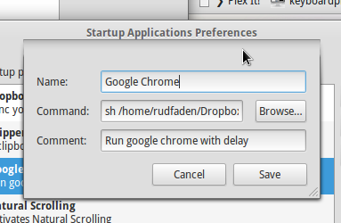

When you use an app almost all the time, you usually want to add it to your list of start up item, to make them start up automatically. However for some apps, like browsers, it opening the app before an Internet connection is established will result in failed page/app loads. Therefore it is nice to know how to delay the start up. This post will focus on [Elementary OS](http://elementaryos.org/), but a similar approach should work in other Ubuntu variants. I will use Google Chrome as an example.

First, open your favorite text editor and paste the following


#!/bin/bash
sleep 10
google-chrome


Save the file somewhere on your hard-drive and name it `chrome_launch.sh`. 

Next you need to make the script executable. To do that run the following from the terminal:


 chmod +x [path to file]/chrome_launch.sh


The Open `system settings -> Startup Applications`. Press `Add` and in the `Command` field, navigate to your bash script. Then at the beginning of your path add `sh`, to tell the terminal to execute the script. 

If you want, you can also add a name and a description. 


sh [path to file]/chrome_launch.sh


My setup looks like this:
  

  

Chrome will now launch with a 10 second delay. This will be enough for the wifi to connect before chrome launches. 